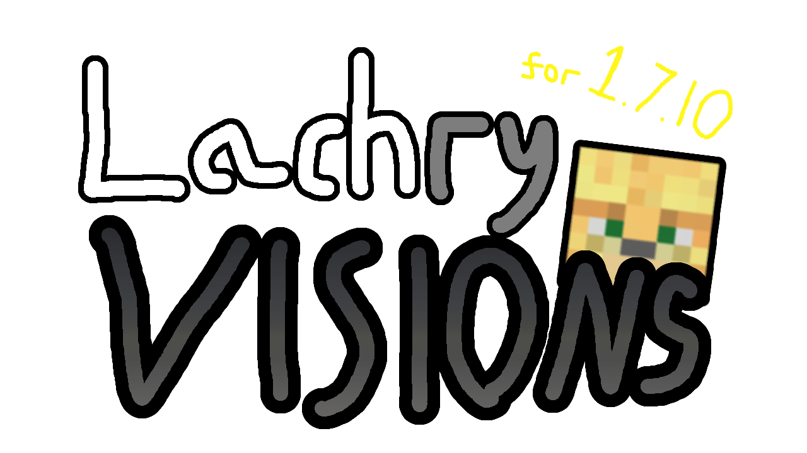

# Lachryvisions for 1.7.10




**Lachryvisions** (pronounced Lack-REVISIONS, name has multiple meanings, Revisions and Vision) 
is a mod for **1.7.10** that aims to extend the functionality of the Minecraft version **1.7.10** 
with new features and certain backported features that are designed to maintain the look and feel of Vanilla Minecraft,
whilst also making the game better.

<p float="left"> 
 
</p>
<p float="left"> 
 
</p>

### My Goals
My goal with this mod is to create a better version of Minecraft, by using 1.7.10 as a base and coming up with new features and
ideas that I think should be in the game. This would include general Quality of Life fixes, Backporting specific features from 1.8 and
adding new Vanilla+ features.
#### What makes this different from something like EtFuturum?
Overall, not much, except my focus for this mod is on purism to a version of Minecraft that's not tainted by Microsoft.
# Features
* Improved Sign Editing
* Boats no longer crash into planks and sticks
* More blocks and slabs 
* More wearable blocks, place a Dispenser on your head!
* Leather boots allow you to avoid trampling on your crops!
* More commands, like /gmc, /gms, /gma
* Improved stack limits of items that are limited to 16, to 64.
# Roadmap / Todo
* Backport good features from new versions (according to my personal tastes)
* Fix bugs and annoyances in 1.7.10
* Add Vanilla items that respect the artstyle of the game.
## Will you port to 1.9+?
No! Although I'm down for making a similar mod for 1.8.9 but removing stuff is harder than adding.

# Installation
Lachryvisions requires [Unimixins](https://www.curseforge.com/minecraft/mc-mods/unimixins) to load mixins and operate correctly. Once you have both mods downloaded, simply
drag and drop them into your mods folder. You must be using the latest version of **1.7.10 Forge**.
# Setup

You must use Java 8 to build the mod. (You can force a specific Java version in your IDE settings, or by setting the `JAVA_HOME` environmental variable if you are building from the command line.)

Building the mod:

```
./gradlew build
```

Running via Gradle:

```
./gradlew runClient
```

To run using a native IDE run configuration, you must add the following program arguments...

```
--tweakClass org.spongepowered.asm.launch.MixinTweaker --mixin mixins.unimixinsexample.json
```

...And the following JVM argument:

```
-Dfml.coreMods.load=me.lachrymogenic.lachryvision.Core
```

## License

This mod extends off of the Unimixins Example Mod and is licensed under the 
[MIT license](LICENSE).
